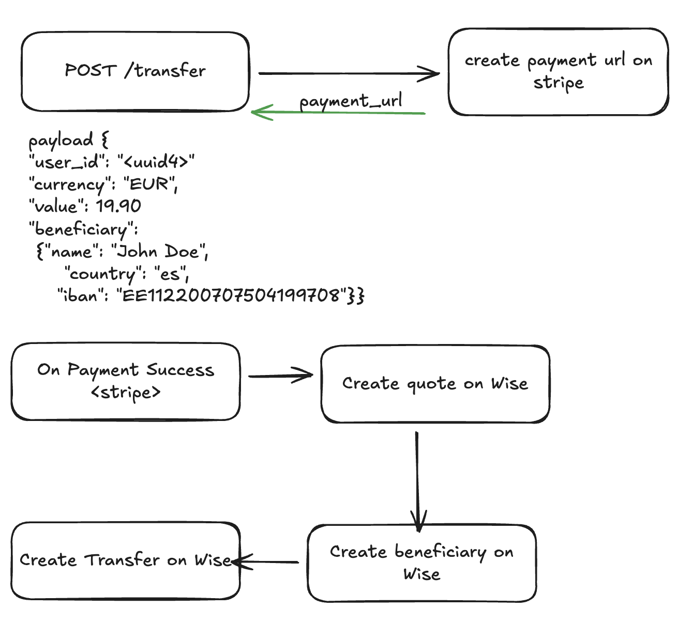

# ⚡️ creditcard-global-transfer

This project is a simple skeleton for sending money around the world using a credit card.

The idea is to connect two services:
- **Stripe** to receive payments by credit card
- **Wise** to manage and send money to other countries

This repository only shows the basic structure. It is not a finished product.

---

## 👀 What this project does

- Receives money from users using a credit card  
- Confirms the payment  
- Keeps track of the money  
- Sends money internationally using Wise  

---

